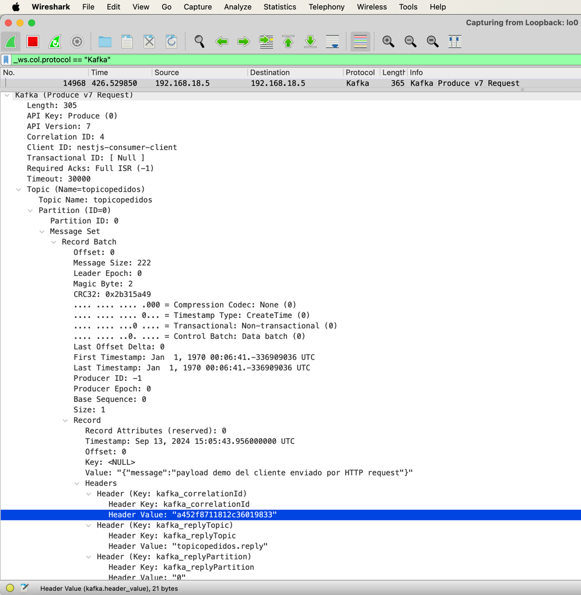
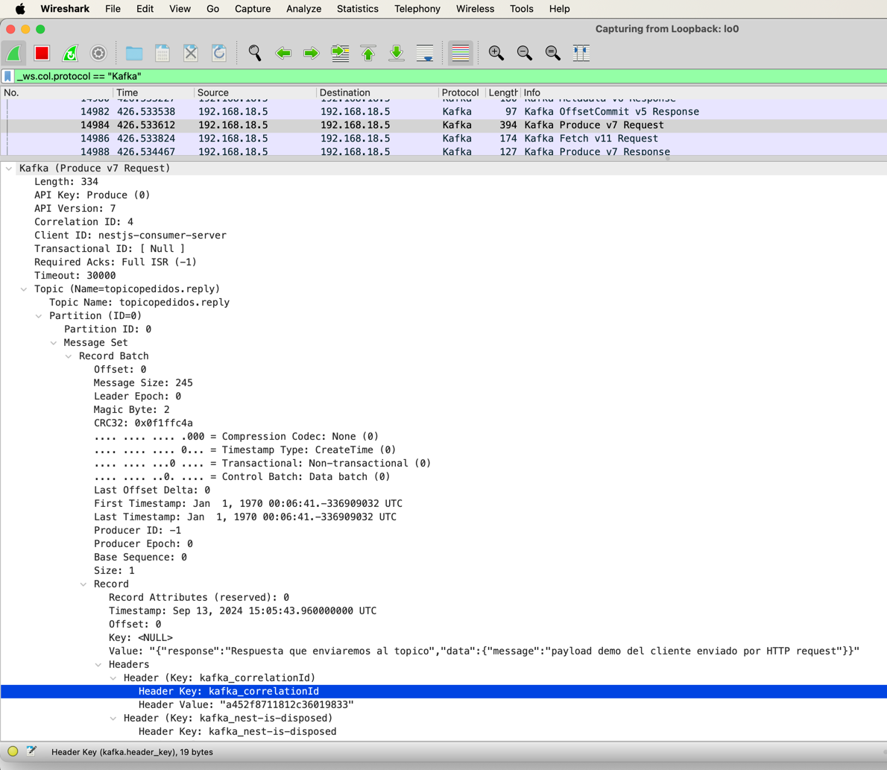

## Alcance PoC

PoC para mostrar como [Nest](https://github.com/nestjs/nest) framework TypeScript implementa de manera nativa el patron 
`Request-Repy` out of the box.

## Setup

```bash
$ npm install
```

## Compilar y correr el proyecto

```bash

# crear topico en kafka
$ cd ./infra
$ docker compose up -d
$ docker exec -it kafkatest /bin/bash
$ /opt/kafka/bin/kafka-topics.sh --bootstrap-server broker:9092 --create --topic topicopedidos
$ /opt/kafka/bin/kafka-topics.sh --bootstrap-server broker:9092 --create --topic topicopedidos.reply

$ 

$ 

/opt/kafka/bin/kafka-topics.sh --alter --zookeeper broker:2181 --topic topicopedidos --partitions 10
/opt/kafka/bin/kafka-topics.sh --alter --zookeeper broker:2181 --topic topicopedidos.reply --partitions 10


/opt/kafka/bin/kafka-topics.sh --bootstrap-server broker:9092 --alter --topic topicopedidos --partitions 10
/opt/kafka/bin/kafka-topics.sh --bootstrap-server broker:9092 --alter --topic topicopedidos.reply --partitions 10

# iniciar ambiente
$ npm run start


```

## Manejo de Header por NestJS

### Creacion del CorrelationID por el Journey

#### Codigo TS

```typescript
  const response$ = this.client.send('topicopedidos', data);
```

### Captura WireShark



```json
Frame 14968: 365 bytes on wire (2920 bits), 365 bytes captured (2920 bits) on interface lo0, id 0
Null/Loopback
Internet Protocol Version 4, Src: 192.168.18.5, Dst: 192.168.18.5
Transmission Control Protocol, Src Port: 52158, Dst Port: 9092, Seq: 422, Ack: 302, Len: 309
Kafka (Produce v7 Request)
    Length: 305
    API Key: Produce (0)
    API Version: 7
    Correlation ID: 4
    Client ID: nestjs-consumer-client
    Transactional ID: [ Null ]
    Required Acks: Full ISR (-1)
    Timeout: 30000
    Topic (Name=topicopedidos)
        Topic Name: topicopedidos
        Partition (ID=0)
            Partition ID: 0
            Message Set
                Record Batch
                    Offset: 0
                    Message Size: 222
                    Leader Epoch: 0
                    Magic Byte: 2
                    CRC32: 0x2b315a49
                    .... .... .... .000 = Compression Codec: None (0)
                    .... .... .... 0... = Timestamp Type: CreateTime (0)
                    .... .... ...0 .... = Transactional: Non-transactional (0)
                    .... .... ..0. .... = Control Batch: Data batch (0)
                    Last Offset Delta: 0
                    First Timestamp: Jan  1, 1970 00:06:41.-336909036 UTC
                    Last Timestamp: Jan  1, 1970 00:06:41.-336909036 UTC
                    Producer ID: -1
                    Producer Epoch: 0
                    Base Sequence: 0
                    Size: 1
                    Record
                        Record Attributes (reserved): 0
                        Timestamp: Sep 13, 2024 15:05:43.956000000 UTC
                        Offset: 0
                        Key: <NULL>
                        Value: "{"message":"payload demo del cliente enviado por HTTP request"}"
                        Headers
                            Header (Key: kafka_correlationId)
                                Header Key: kafka_correlationId
                                Header Value: "a452f8711812c36019833"
                            Header (Key: kafka_replyTopic)
                                Header Key: kafka_replyTopic
                                Header Value: "topicopedidos.reply"
                            Header (Key: kafka_replyPartition)
                                Header Key: kafka_replyPartition
                                Header Value: "0"

```

### Escritura del CorrelationID en el Topico Respuesta

#### TypeScript

NestJS nos ayuda en el proceso de generacion de correlacion ID

```typescript
  /*
  LAS LINEAS SIGUIENTE SIMULAN A LO QUE HARIA UN ORQUESTADOR PARA HACER SUSCRIBE AL TOPICO DE PEDIDOS QUE DEJARIA EL JOURNEY
   */

// Esta funcion debe procesar los mensajes que llegan al topico que se defina,
// luego debe retornar una respuesta que tomada por el engine NestJS y enviara esta respuesta
// a traves del topico de repuesta generado automaticamente
@MessagePattern('topicopedidos')
async handleRequest(data: any) {
  // Aca se procesa el request del cliente
  // El nombre del topico de respuesta que se genera ES .REPLY
  // Estos topicos deberian ser efimeros: se deben de borar poco despues que se reciba la respuesta (FIXME! Revisar documentacion)
  // Para que funciones este patron de SOLICITUD-RESPUESTA cpn Kafka este patron necesita un Topico?Cana unico
  // Definimos el mensaje que enviaremos al topico de respuesta con el sigueinte payload
  return { response: 'Respuesta que enviaremos al topico', data }; //TOPICO .REPLY CREADO
}
```
#### Captura WireShark



```json
Frame 14984: 394 bytes on wire (3152 bits), 394 bytes captured (3152 bits) on interface lo0, id 0
Null/Loopback
Internet Protocol Version 4, Src: 192.168.18.5, Dst: 192.168.18.5
Transmission Control Protocol, Src Port: 52160, Dst Port: 9092, Seq: 463, Ack: 320, Len: 338
Kafka (Produce v7 Request)
    Length: 334
    API Key: Produce (0)
    API Version: 7
    Correlation ID: 4
    Client ID: nestjs-consumer-server
    Transactional ID: [ Null ]
    Required Acks: Full ISR (-1)
    Timeout: 30000
    Topic (Name=topicopedidos.reply)
        Topic Name: topicopedidos.reply
        Partition (ID=0)
            Partition ID: 0
            Message Set
                Record Batch
                    Offset: 0
                    Message Size: 245
                    Leader Epoch: 0
                    Magic Byte: 2
                    CRC32: 0x0f1ffc4a
                    .... .... .... .000 = Compression Codec: None (0)
                    .... .... .... 0... = Timestamp Type: CreateTime (0)
                    .... .... ...0 .... = Transactional: Non-transactional (0)
                    .... .... ..0. .... = Control Batch: Data batch (0)
                    Last Offset Delta: 0
                    First Timestamp: Jan  1, 1970 00:06:41.-336909032 UTC
                    Last Timestamp: Jan  1, 1970 00:06:41.-336909032 UTC
                    Producer ID: -1
                    Producer Epoch: 0
                    Base Sequence: 0
                    Size: 1
                    Record
                        Record Attributes (reserved): 0
                        Timestamp: Sep 13, 2024 15:05:43.960000000 UTC
                        Offset: 0
                        Key: <NULL>
                        Value: "{"response":"Respuesta que enviaremos al topico","data":{"message":"payload demo del cliente enviado por HTTP request"}}"
                        Headers
                            Header (Key: kafka_correlationId)
                                Header Key: kafka_correlationId
                                Header Value: "a452f8711812c36019833"
                            Header (Key: kafka_nest-is-disposed)
                                Header Key: kafka_nest-is-disposed
                                Header Value: 00

```

## Testing 

```shell
$ docker build -t mi-aplicacion-nestjs:latest .
$ docker run -it -p 3000:3000 mi-aplicacion-nestjs:latest
```

## Pasos a evaluar/Considerar:

El utilitario que usamos para crear el cliente de kafka es un componente que no tiene mucha adopcion en el ecosistema de JS Kafka Client

```json

  "name": "kafkajs",
  "version": "2.2.4",
  "description": "A modern Apache Kafka client for node.js",
  "author": "Tulio Ornelas <ornelas.tulio@gmail.com>",
  "main": "index.js",
  "types": "types/index.d.ts",
  "license": "MIT",
  "keywords": [
    "kafka",
    "sasl",
    "scram"
  ],
  "engines": {
    "node": ">=14.0.0"
  },
  "repository": {
    "type": "git",
    "url": "https://github.com/tulios/kafkajs.git"
  },
  "bugs": {
    "url": "https://github.com/tulios/kafkajs/issues"
  },
```
